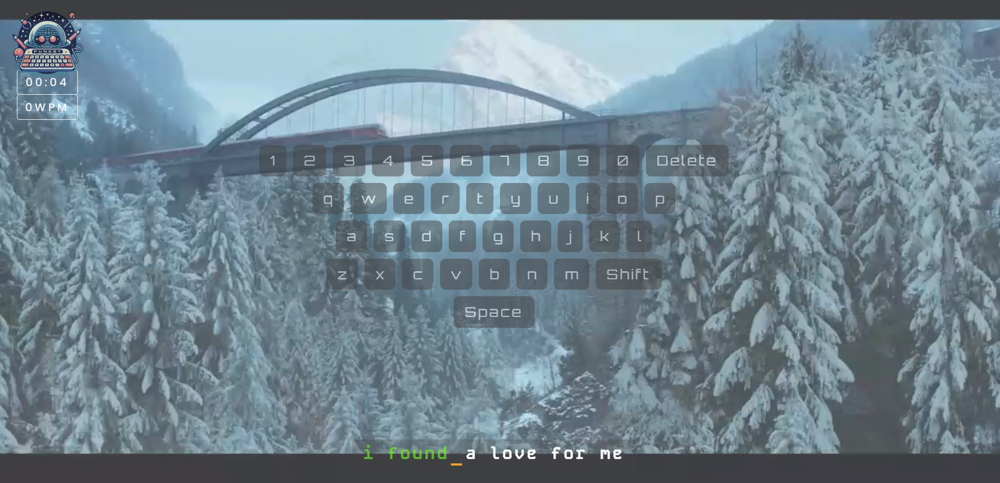
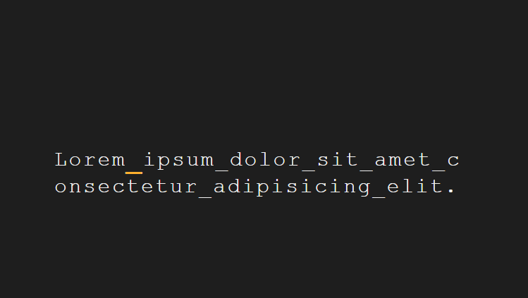
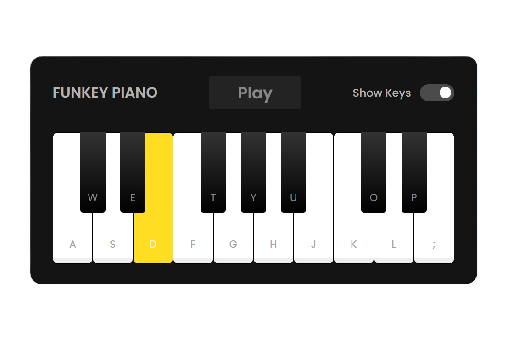

<h1 align="center">⌨️ Funkey: Typing Practice Website</h1>

<p align="center">

</p>

Funkey is a web application designed to help users improve their typing skills in a fun and engaging way. Users can practice typing in three different modes:

1. **Lyrics Typing 🎧**
   - Users can type the lyrics of popular songs. They can choose from a list of pre-selected songs or upload their own lyrics.

	 

	 

   - This mode allows music enthusiasts to combine their love for lyrics with typing practice.

	</br>

	<p align="right">
	
	</p>

2. **AI-Generated Texts 🤖**
   - Instead of the usual "Lorem Ipsum" placeholder text, Funkey provides AI-generated sentences that sound familiar and interesting.
   - Users can practice typing sentences that resemble real-world content.
	<p align="right">
	
	</p>

3. **Virtual Piano Typing 🎹**
   - Funkey includes a virtual piano keyboard. Users can type the notes of melodies, chords, or even their own compositions.
   - This mode combines music and typing practice, making it enjoyable for both musicians and beginners.
	<p align="right">
	
	</p>

## Installation

1. Clone this repository to your local machine:
   ```
   git clone https://github.com/yourusername/funkey.git
   ```

2. Install the necessary dependencies:
   ```
   cd funkey
   npm install
   ```

3. Start the development server:
   ```
   npm start
   ```

## Usage

1. Visit the Funkey website at [http://localhost:3000](http://localhost:3000).
2. Choose your preferred typing mode (lyrics, AI-generated texts, or virtual piano).
3. Start typing and improve your speed and accuracy!

## Technologies Used

- Node.js
- Express
- MongoDB (for storing user-uploaded lyrics)

## Contributing

Contributions are welcome! If you'd like to contribute to Funkey, follow these steps:

1. Fork the repository.
2. Create a new branch: `git checkout -b feature/my-feature`.
3. Make your changes and commit them: `git commit -m "Add my feature"`.
4. Push to the branch: `git push origin feature/my-feature`.
5. Submit a pull request.

## License

This project is licensed under the MIT License. See the [LICENSE](LICENSE) file for details.


## Acknowledgments

- The website template for Funkey was adapted from the [Cyborg Gaming Website Template](https://github.com/themewagon/cyborg) project by [Theme Wagon](https://github.com/themewagon).
- The virtual piano component was inspired from a youtube tutorial by [CodingNepal](https://www.youtube.com/watch?v=Mv1ZYpo8q4g).
